# Setting Up Billing Alarms

As we discussed earlier.  Billing alarms and billing anomaly detection is integral
to the early detection of security incidents.  In fact in many cases billing alarms
are the simplest way to detect a security breach.  ( Cryptocurrency mining comes to mind. )

In this lab we are going to use my CDK bootstrap and project to deploy billing alarms to your root account.  Since all subordinate accounts will roll up to this account it is the 
**only** place that you will need to deploy billing monitoring.

## Lab Instructions 

1. First, you should setup a manual Budget as shown in the slides to notify you of spending on your account during the course. **Remember, you are responsible for costs you incur during class -- monitor them or you may have a bad time!**
2. Change to the UnFederatedAdmin role ( or run `aws-vault exec unfederatedadmin` ), open the Billing Dashboard and navigate to Budgets.

   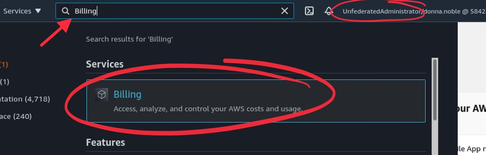
   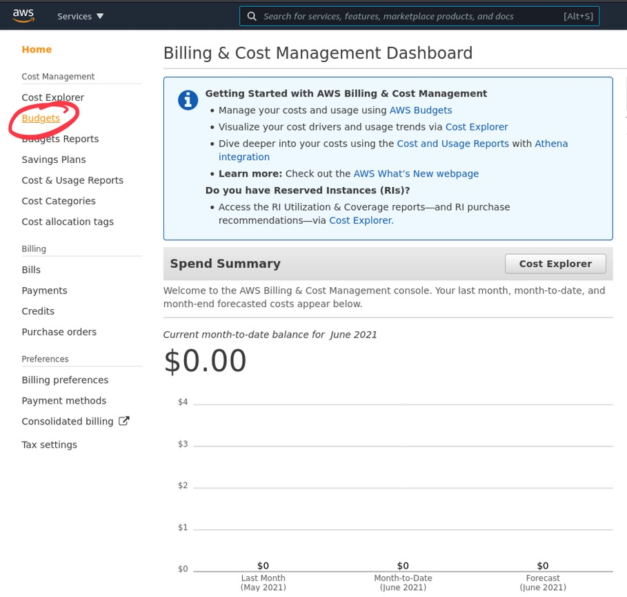

3. Create a budget, specify Cost budget, and change the period to Daily. Enter a fixed amount you're comfortable with ( e.g. $20 ). Set your alert threshold and enter an alert email.

   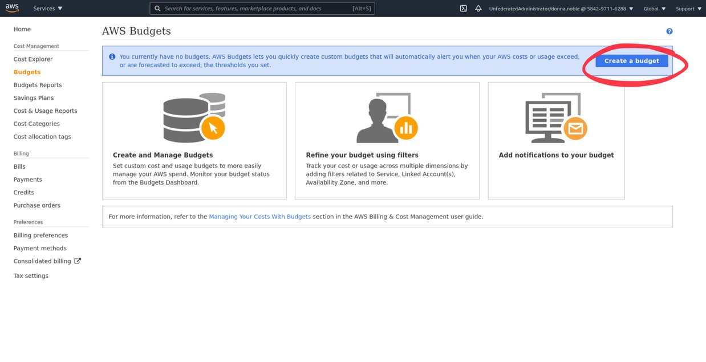
   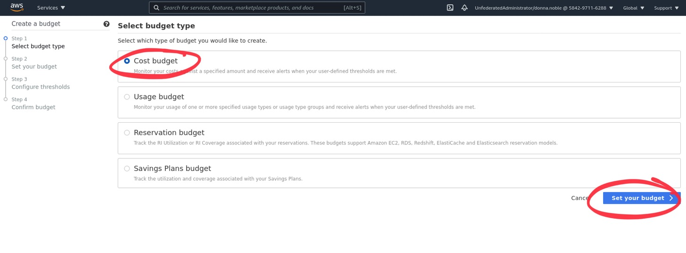
   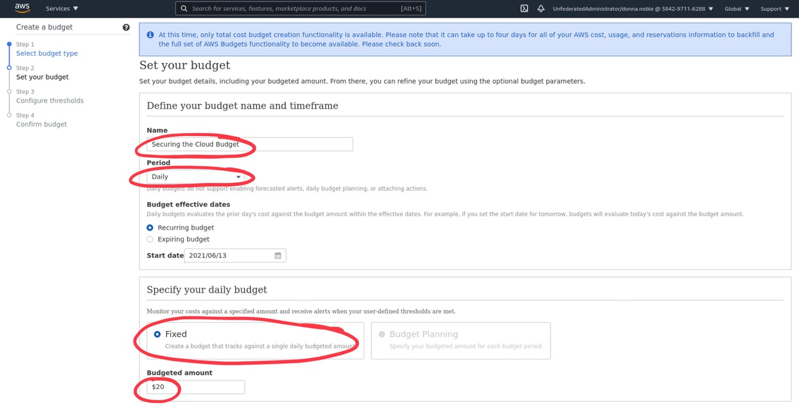
   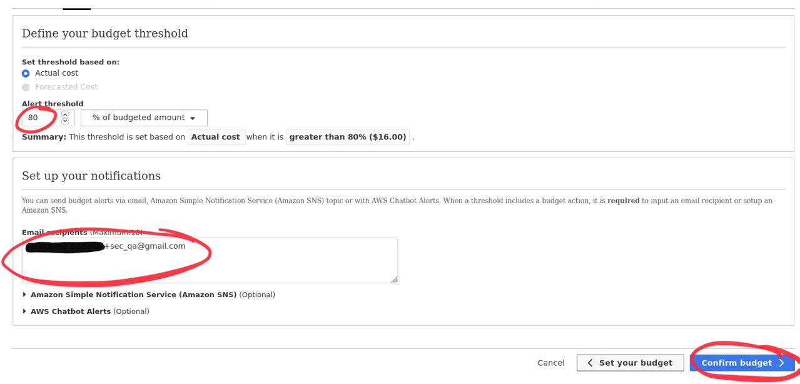
   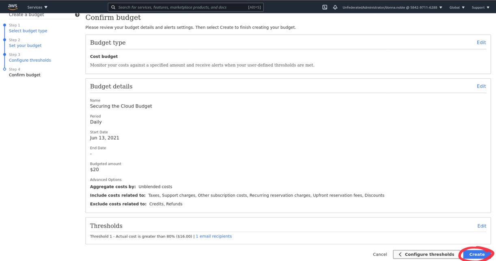
   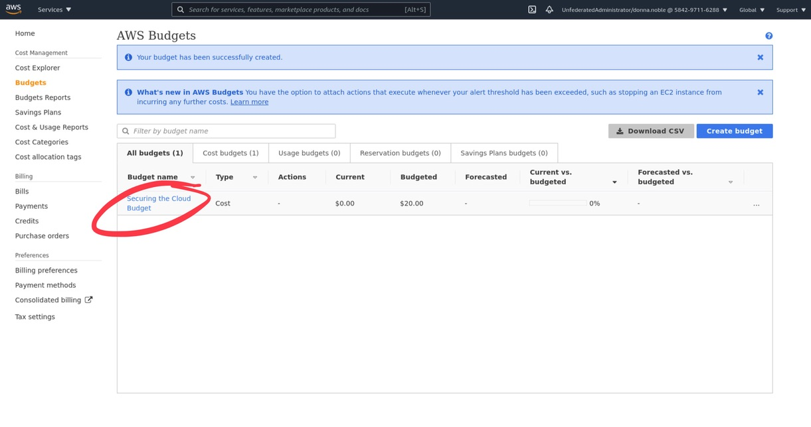

4. Next, inside of your course VM we need to bootstrap the CDK.  You can do so by running the following commands to get the python environment set up and cdk installed. If you have an issue here's the [installation-instructions](https://docs.aws.amazon.com/cdk/latest/guide/getting_started.html).  
   * `cd` into the `supplemental/01-03` directory, which contains a CDK project.
      
      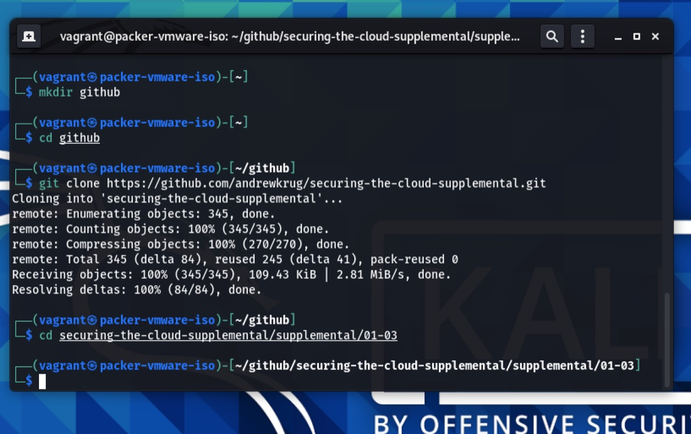
   
   * `sudo npm install -g aws-cdk`
   
      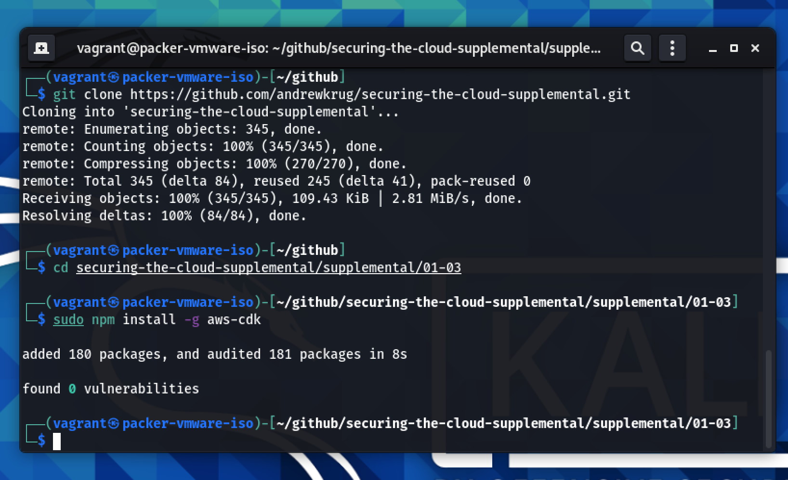
   
   * `sudo apt install python3-venv`
   
      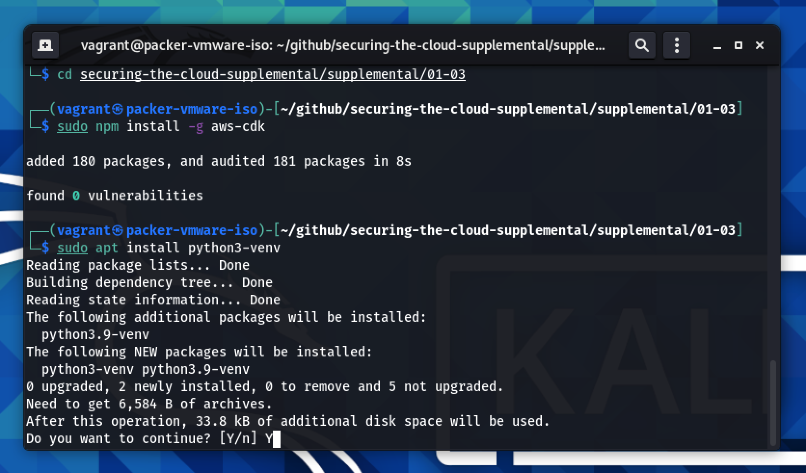
   
   * `python3 -m venv venv`
   * `source venv/bin/activate`
   
      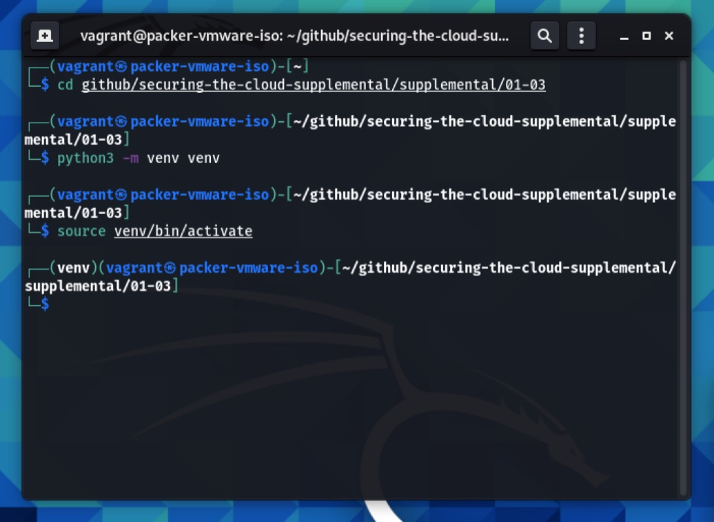
   
   * `pip3 install -r requirements.txt`
   
      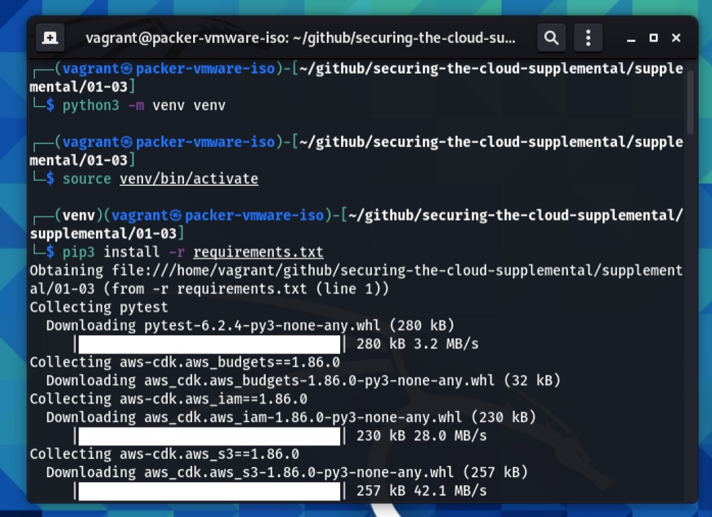

5. Run `aws-vault exec unfederatedadmin` to login to the admin role for the root account.
6. Run `cdk bootstrap` once to setup the CDK in your root account.

   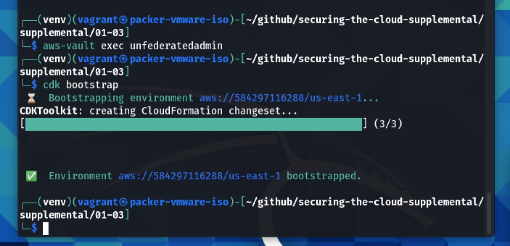

7. Run `cdk deploy --parameters EmailDistributor=YOUREMAIL` to deploy the billing alarm stack.  Be sure to change the email. The parameter is case sensitive.

   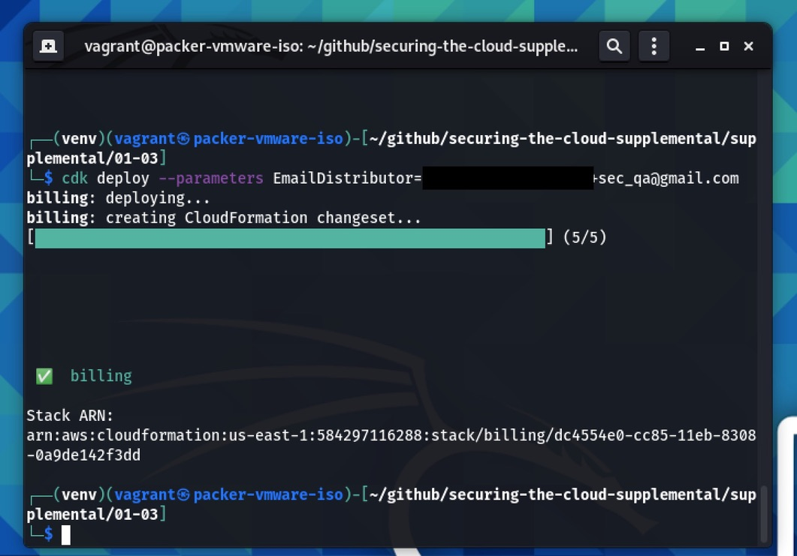

8. Log in to the AWS Console and see the result in the "Billing" Section.

   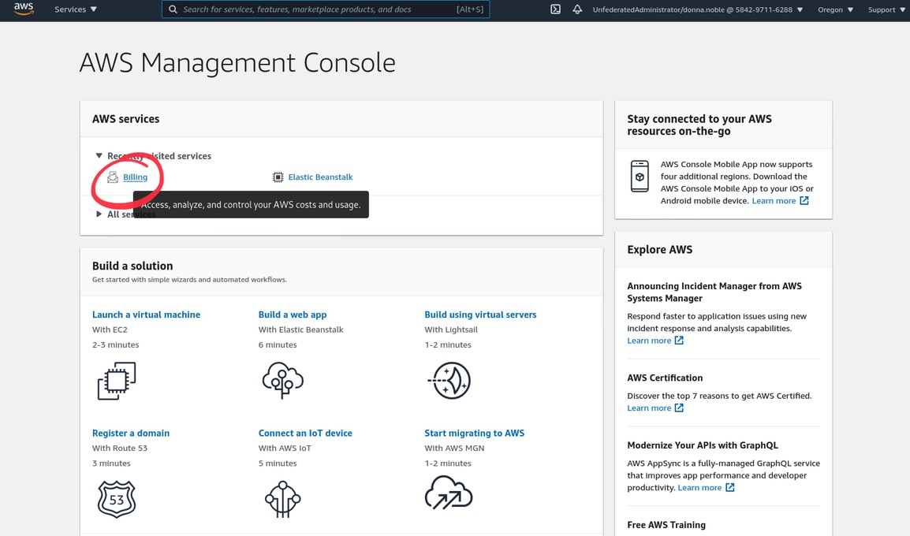
   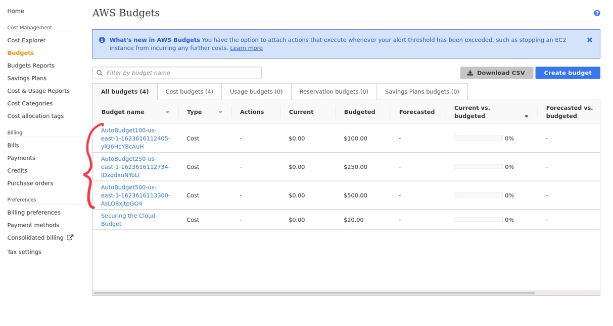

This seems easy.  But ... lots of heavy lifting has been done here to set up the alarms for you.  Click around a bit and explore the budget options.
